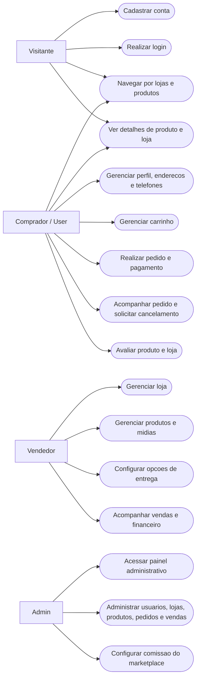
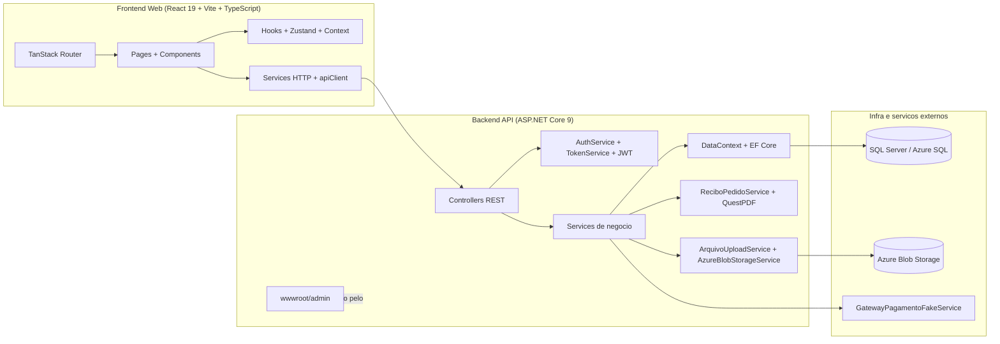
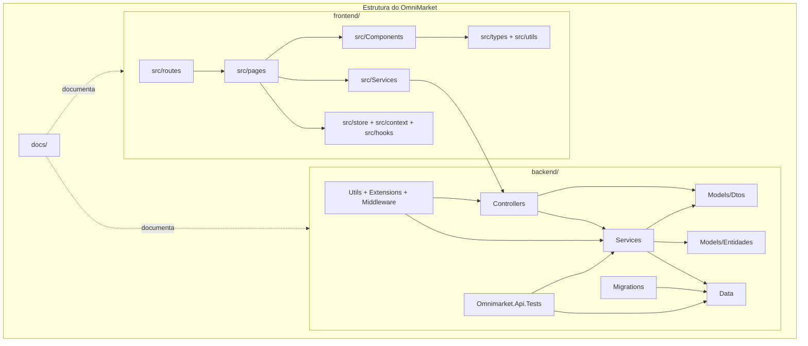
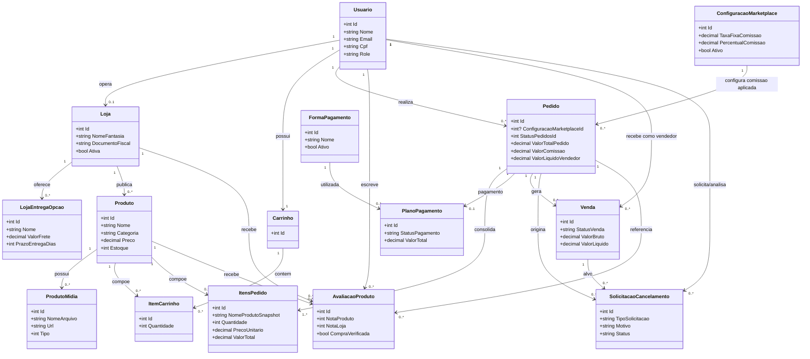

# UML do projeto atual

Fontes consideradas:
- `README.md`
- `docs/ARQUITETURA.md`
- `docs/RBAC.md`
- `backend/Program.cs`
- `backend/Controllers/`
- `backend/Services/`
- `frontend/src/routes/`
- `docs/DER_BANCO_ATUAL.md`

Data de referencia do levantamento: `2026-06-14`

Complemento importante:
- para um diagrama de classes mais completo e dedicado ao TCC, veja `docs/DIAGRAMA_CLASSES_OPEN_MINIMARKET.md`

## Leitura adotada

Para "UML do projeto", assumi uma visao arquitetural e funcional do sistema inteiro, e nao um desenho exaustivo de cada classe do repositorio. Por isso, a documentacao foi separada em quatro visoes:

- casos de uso do sistema
- componentes e integracoes
- pacotes/modulos do projeto
- classes centrais do dominio

## 1. Casos de uso do sistema

Observacao:
- O papel `Suporte` existe no codigo (`RolesSistema`), mas a documentacao atual ainda nao define com clareza seus limites. Por isso ele nao entrou como ator principal neste diagrama.

## 2. Componentes e integracoes

## 3. Pacotes e modulos do projeto

## 4. Classes centrais do dominio

Observacao:
- Esta e uma visao de alto nivel das entidades principais do negocio.
- O detalhamento fisico completo das tabelas, colunas e FKs esta em `docs/DER_BANCO_ATUAL.md`.

## 5. Rotas e modulos visiveis no frontend atual

Rotas identificadas em `frontend/src/routes/`:

- `/`
- `/login`
- `/cadastro`
- `/recuperarSenha`
- `/carrinho`
- `/paginaPagamento`
- `/paginaConfirmacaoPix`
- `/paginaSucesso`
- `/perfilUsuario`
- `/loja/$id`
- `/produto/$id`

Fluxos organizados em `src/pages/`:

- autenticacao
- home
- carrinho
- pedido e pagamento
- loja
- produto
- perfil do usuario

## 6. Observacoes arquiteturais importantes

- O sistema esta organizado com separacao clara entre `backend/`, `frontend/` e `docs/`.
- O backend centraliza autenticacao JWT, negocio, persistencia EF Core, upload em Blob e geracao de PDF.
- O frontend consome a API por uma camada de services e usa TanStack Router para navegacao.
- Existe uma interface administrativa estatica em `backend/wwwroot/admin`, entao hoje o admin esta parcialmente fora do frontend React.
- O health check leve da API esta em `/health`, e o de conectividade de banco em `/health/database`.
- O gateway de pagamento atual registrado na aplicacao e `GatewayPagamentoFakeService`, entao o desenho financeiro ainda depende de integracao simulada.

## 7. Relacao com o DER

Se voce for apresentar os dois juntos, a leitura mais natural fica assim:

1. `UML_PROJETO_ATUAL.md`: mostra como o sistema esta organizado e como os modulos conversam.
2. `DER_BANCO_ATUAL.md`: mostra como o banco foi estruturado fisicamente.
3. `TBL_PEDIDO`: e o principal elo entre o fluxo comercial e o fluxo financeiro.
